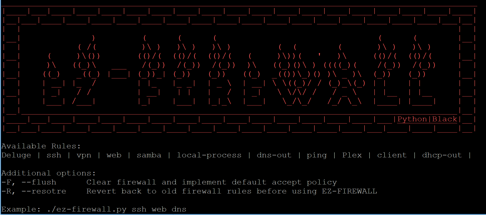

*The easiest way to implement iptables*

This tool utilizes iptables for easily implementing a default drop policy for a host-based firewall.

### Usage:
**Example:** ```sudo ./ez-firewall.py ssh web dns```

Yes, it's that easy! The command above will implement the corresponding input and output iptable rules, so you only have to type one command instead of 6.

**Additional options:**

```-F``` or ```--flush``` Clear firewall and implement default accept policy

```-R``` or ```--resotre``` Revert back to old firewall rules before using EZ-FIREWALL

Fortunately, for protocols that require multiple ports to be opened, ez-firewall will automatically iterate through all the required iptable rules so you don't have to worry. And for your convenience, you can make a backup of your current firewall rules or restore them after you’ve made changes using ez-firewall.

### Adding More Rules:
Firewall rules are formatted in a dictionary-list and can be added to and modified as needed.

**The format is as follows:** ```{"protocol 1":["INPUT chain rule","OUTPUT chain rule"],"protocol 2":["INPUT chain rule 1","OUTPUT chain rule 1","INPUT chain rule 2","OUTPUT chain rule 2"]}```

**Example rule:** ```{"web":["iptables -A INPUT -p tcp -m multiport --sports 80,443 -m state --state ESTABLISHED -j ACCEPT","iptables -A OUTPUT -p tcp -m multiport --dports 80,443 -m state --state NEW,ESTABLISHED -j ACCEPT"]}```
